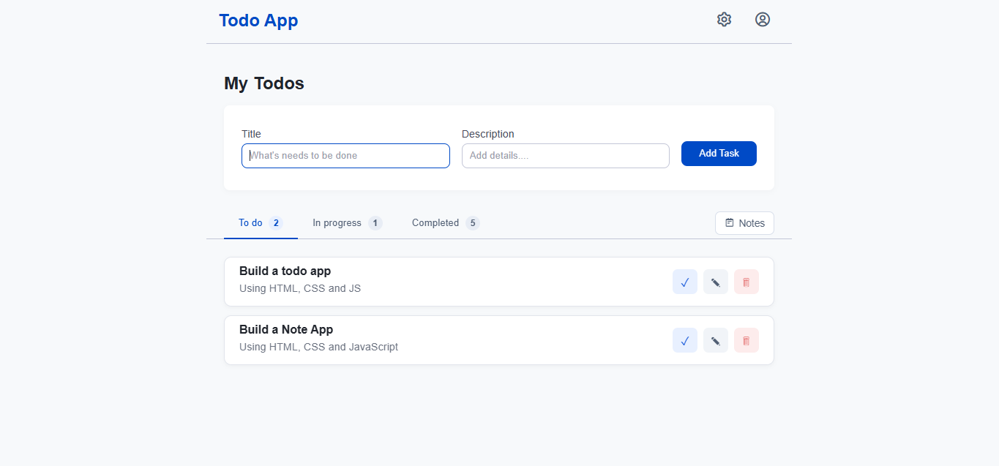

# Todo App

A responsive Todo application built with HTML, CSS and vanilla JavaScript.

This project was built to strengthen my JavaScript fundamentals through a practical application with real CRUD operations, state management and browser storage.

## 🔗 Live Demo

[View Live Demo](https://mzwandilem.github.io/To-do-App/)

## 📸 Screenshot



## ✨ Features

### Todo Management

- Create tasks with a title and description
- Edit existing tasks
- Delete tasks
- Move tasks from To Do to In Progress
- Mark tasks as completed
- Move completed tasks back to In Progress
- Track task completion dates
- Filter tasks by status
- Display task counts for each status

### Notes

- Create notes
- Edit notes
- Delete notes
- Add note creation dates
- Use a textarea for longer notes
- Switch between Tasks and Notes views

### Data Persistence

- Tasks are stored in `localStorage`
- Notes are stored in `localStorage`
- Data remains available after refreshing the browser

### UI

- Responsive layout
- Scrollable task and note lists
- Status navigation
- Task counters
- Action buttons with contextual colors
- Empty states
- Completed task styling
- Responsive mobile layout

## 🛠️ Technologies

- HTML5
- CSS3
- JavaScript
- LocalStorage API
- Browser Crypto API
- Boxicons

## 🧠 JavaScript Concepts Practiced

This project helped me practice:

- DOM manipulation
- Event listeners
- Event delegation
- Arrays and objects
- `map`, `filter` and `find`
- Functions
- Conditional rendering
- Template literals
- CRUD operations
- LocalStorage
- JSON serialization
- UUID generation
- Date handling
- Form handling
- State management
- Dynamic HTML rendering
- Input validation
- HTML escaping

## 📁 Project Structure

```text
todo-app/
│
├── index.html
├── style.css
├── script.js
├── screenshot.png
└── README.md
